# Guía de Explotación - Basic Pentesting

## 1. Reconocimiento

Comenzamos con un escaneo de Nmap para identificar los puertos abiertos y servicios disponibles en la máquina objetivo. Ejecutamos el siguiente comando:

```bash
nmap -sC -p- --open -n --max-rate 1000 -sV IP_MAQUINA_ATACADA
```

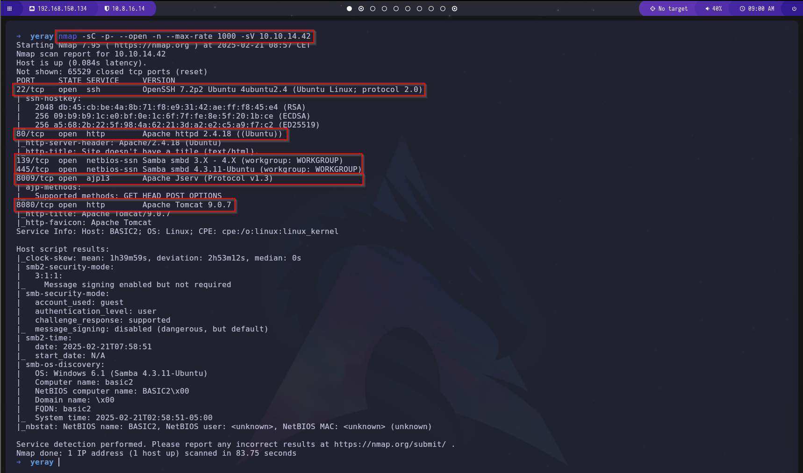

El escaneo revela los siguientes puertos abiertos:
- **22/TCP** (SSH)
- **80/TCP** (HTTP)
- **139/TCP** (SMB)
- **445/TCP** (SMB)
- **8009/TCP** (Apache JServ)
- **8080/TCP** (HTTP)

Exploramos el puerto `80` en un navegador y encontramos la siguiente página:

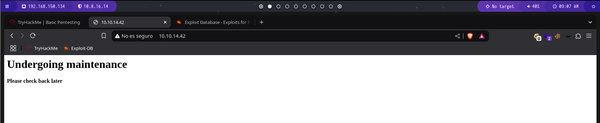

Al acceder al puerto `8080`, observamos otra página diferente:

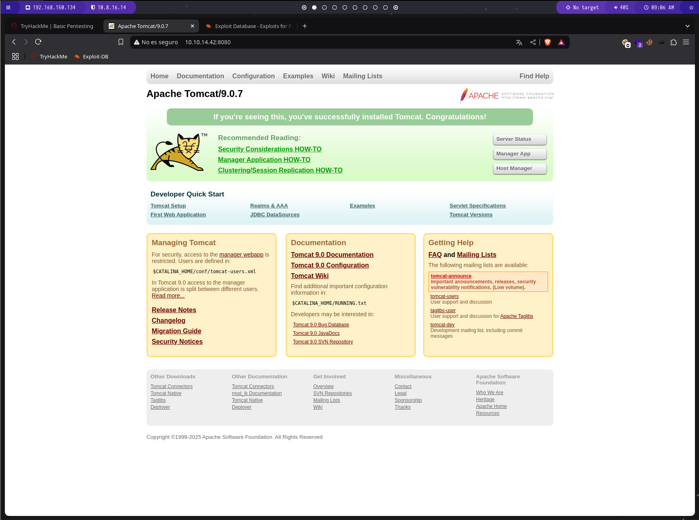

Para descubrir directorios ocultos en el sitio web, utilizamos la herramienta `gobuster`:

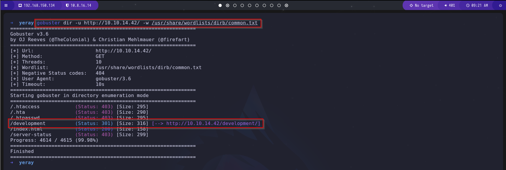

El escaneo revela la existencia de un directorio llamado `development`. Dentro de este directorio encontramos dos archivos: `dev.txt` y `j.txt`.

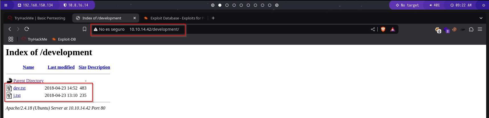

Al inspeccionar `dev.txt`, descubrimos conversaciones entre los usuarios `-J` y `-K`, y confirmamos que la versión de Apache utilizada es `2.5.12`.

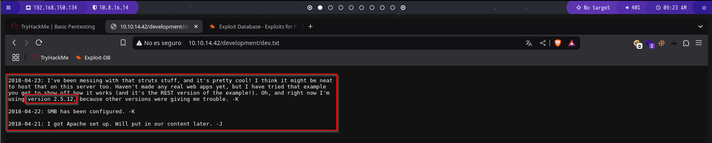

En `j.txt`, encontramos una referencia a que la contraseña del usuario `-J` es débil, lo que nos da una pista para seguir con el ataque.

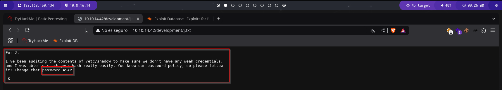

## 2. Enumeración y Explotación SMB

Para obtener más información sobre el servicio SMB, utilizamos un script de Nmap:

```bash
nmap --script="smb-enum-shares" -p139 IP_MAQUINA_ATACADA
```

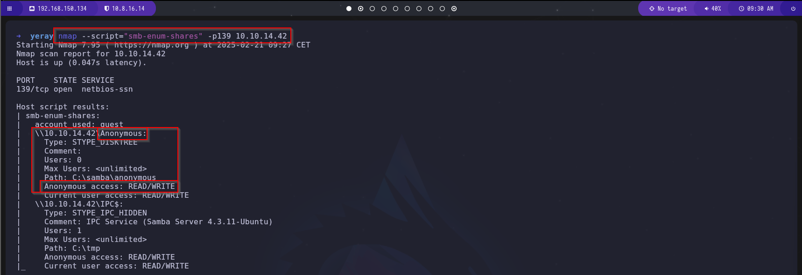

El escaneo revela un recurso compartido llamado `/Anonymous`, al que podemos acceder con el usuario `anonymous`.

```bash
smbclient //10.10.14.42/Anonymous -p 139 -U anonymous
```

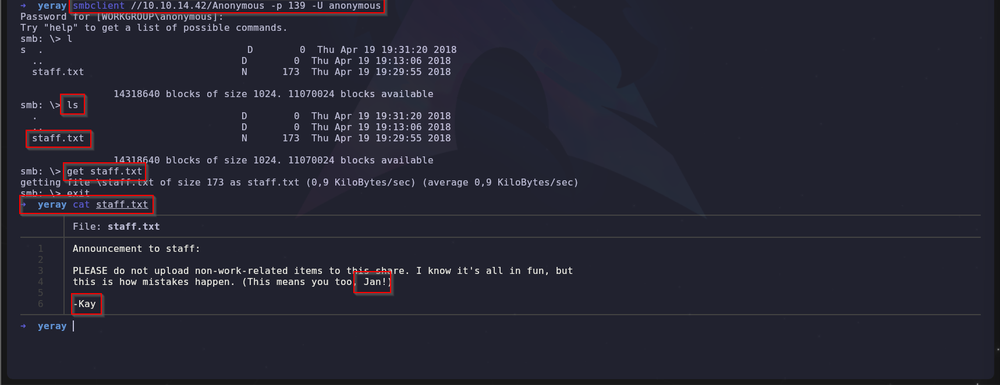

Dentro de este recurso encontramos referencias a los usuarios `Jan` y `Kay`. Como sabemos que la contraseña de Jan es débil, intentamos descifrarla usando `Hydra`.

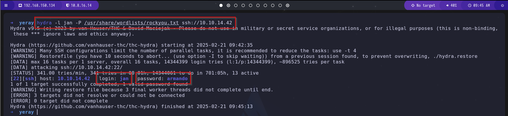

Hydra logra obtener la contraseña de `Jan`, lo que nos permite establecer una sesión SSH.

## 3. Escalada de Privilegios

Nos conectamos por SSH con el usuario `Jan`:

```bash
ssh jan@IP_MAQUINA_VICTIMA
```

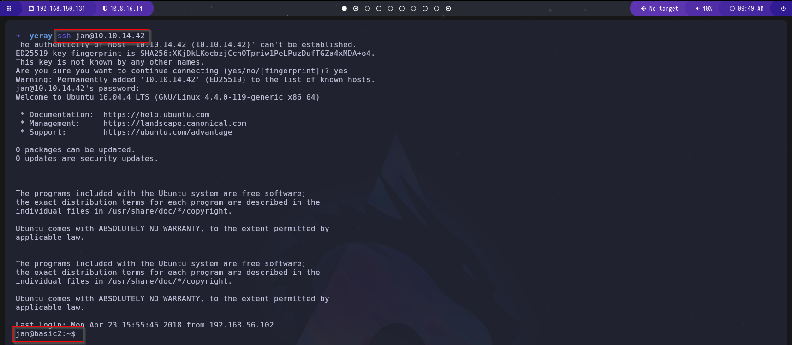

Exploramos el sistema y encontramos que el usuario `Kay` tiene claves RSA accesibles.

```bash
cd /home/kay/.ssh
```

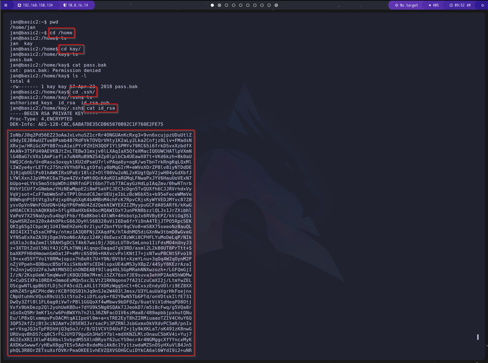

Copiamos la clave privada y la guardamos en un archivo llamado `kay_rsa` en nuestra máquina atacante.

```bash
nano kay_rsa
chmod 600 kay_rsa
```

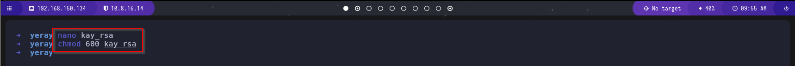

Intentamos conectarnos con la clave privada, pero encontramos que está protegida por una frase de contraseña.

```bash
ssh -i kay_rsa kay@IP_MAQUINA_ATACANTE
```

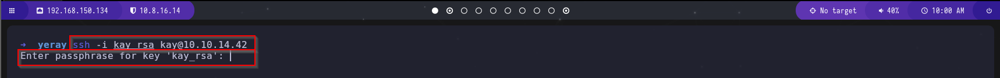

Para descifrar la frase de contraseña, utilizamos `John the Ripper` con `ssh2john`.

Convertimos la clave en un hash:

```bash
/usr/share/john/ssh2john.py kay_rsa > kayhash.txt
```

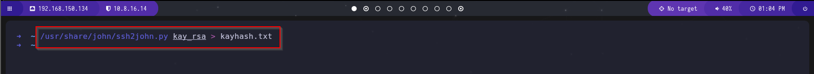

Luego, usamos `John the Ripper` con el diccionario `rockyou.txt`:

```bash
john kayhash.txt --wordlist=/usr/share/wordlists/rockyou.txt
```

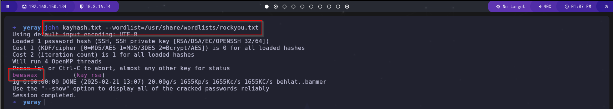

Con la frase de contraseña descifrada, ahora podemos conectarnos como `Kay`.

```bash
ssh -i kay_rsa kay@IP_MAQUINA_ATACANTE
```

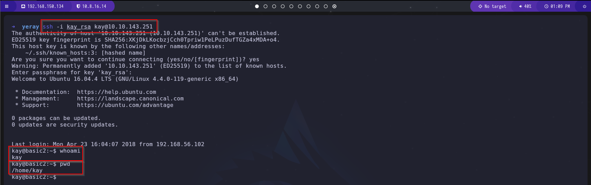

Una vez dentro, encontramos el archivo `pass.bak`, que contiene la contraseña final.

```bash
cat pass.bak
```

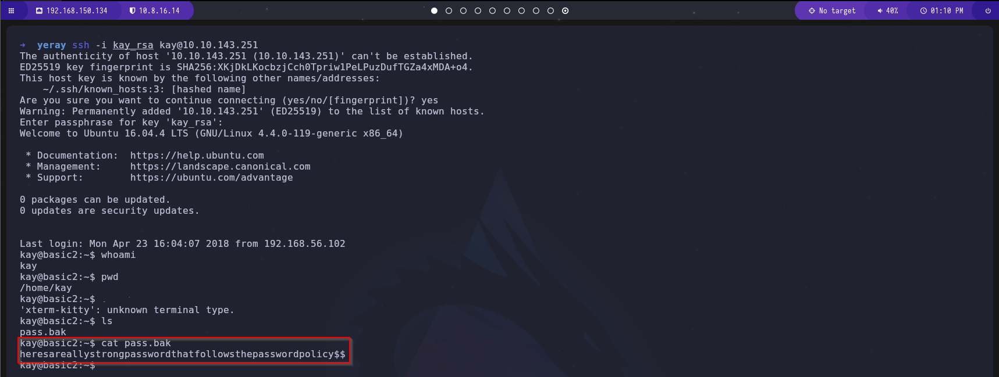

¡Máquina comprometida con éxito!
