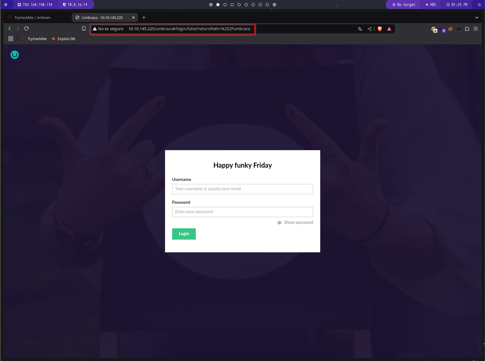

# Guía de Explotación - TryHackMe Anthem

## 1. Análisis del sitio web

Comenzamos con el reconocimiento de la máquina objetivo mediante un escaneo de Nmap. Utilizamos el siguiente comando para identificar servicios y versiones:

```bash
nmap -Pn -sV -sC -T5 IP_MAQUINA_ATACADA
```


El escaneo revela los siguientes puertos abiertos:
- **80/TCP** (HTTP - Servidor Web IIS)
- **3389/TCP** (RDP - Escritorio Remoto)

Ahora vamos a analizar el contenido del puerto 80.


Probamos si existe un archivo `robots.txt`, y vemos que sí.


Podemos ver lo que el rastreador está buscando (permitido/no permitido), pero también encontramos el texto `UmbracoIsTheBest!`, que podría ser una posible contraseña.

Además, observamos que el CMS utilizado es `Umbraco`, ya que en las rutas no permitidas aparece un directorio `/umbraco/`, al que accederemos a continuación.



Nos encontramos con una pantalla de inicio de sesión que requiere un usuario y una contraseña. Ya tenemos la contraseña, pero desconocemos el nombre de usuario, por lo que debemos investigarlo.

En el blog, encontramos un poema. Tras buscar en Google, descubrimos que el nombre del poema es `Solomon Grundy`. Probamos este nombre en TryHackMe como usuario y verificamos que es correcto.


También se nos solicita encontrar el correo electrónico del administrador. Continuamos explorando el blog.

Encontramos el correo `JD@anthem.com`. Suponiendo que la empresa sigue un formato de correo fijo, podemos suponer que el correo de nuestro usuario sería `SG@anthem.com`.


## 2. Localización de banderas

La mayoría de las banderas se encuentran en el código fuente del sitio web. Para hallarlas, inspeccionamos el elemento y buscamos en todas las páginas.

La primera bandera está en `http://IP_MAQUINA/archive/we-are-hiring/`:

```txt
THM{L0L_WH0_US3S_M3T4}
```


La segunda está en la página principal `http://IP_MAQUINA/`:

```txt
THM{G!T_G00D}
```


La tercera se encuentra en `http://IP_MAQUINA/authors/jane-doe/`:

```txt
THM{L0L_WH0_D15}
```


Por último, la cuarta está en `http://IP_MAQUINA/archive/a-cheers-to-our-it-department/`:

```txt
THM{AN0TH3R_M3TA}
```


## 3. Etapa final

Ahora intentaremos acceder a la máquina utilizando el puerto `3389`. Para ello, usaremos `Remmina` para establecer una conexión remota.

Los datos de acceso que encontramos anteriormente son:

```txt
Usuario: SG
Contraseña: UmbracoIsTheBest!
```


Dentro del sistema, encontramos un archivo `user.txt`. Al abrirlo, descubrimos otra bandera.


A continuación, debemos encontrar la contraseña del usuario `Administrador`.

Observamos una carpeta de copia de seguridad en la `unidad C` que podría ser interesante.


Intentamos acceder al archivo, pero no tenemos permisos.


Revisemos la configuración de seguridad. Para ello, hacemos clic derecho sobre el archivo, seleccionamos `Propiedades` y vamos a la pestaña `Seguridad`.


Presionamos `Editar` para cambiar los permisos.


Hacemos clic en `Agregar` para añadir un usuario. Intentamos agregar permisos al usuario `SG`, escribimos `SG` en el campo de texto y presionamos `Comprobar nombres`.


Aceptamos y aplicamos los cambios.

Ahora podemos abrir el archivo de texto y encontramos la contraseña del `Administrador`.


Con esta contraseña, iniciamos sesión como `Administrador`. En su escritorio encontramos un archivo llamado `root.txt`.


Al abrirlo, encontramos la última bandera.


¡Máquina comprometida con éxito!
